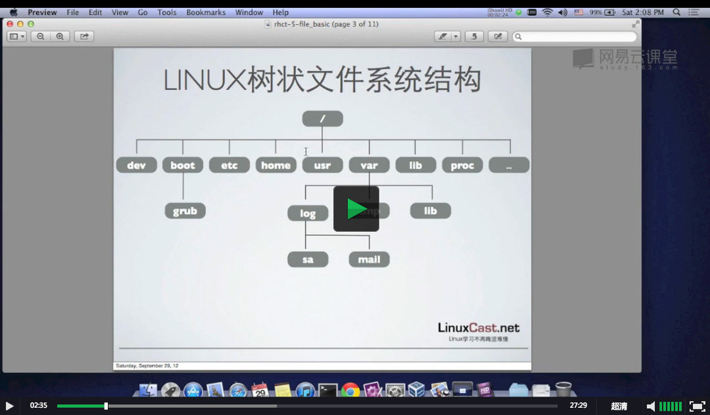

## 课时4 Linux文件系统基本结构

### Linux文件系统结构
* Linux文件系统为一个倒转的单根树状结构
* 文件系统的根为“/”
* 文件系统严格区分大小写
* 路径使用“/”分割，（windows中使用“\”）

### Linux树状文件系统结构

### 当前工作目录
每一个shell或系统继承都有一个当前工作目录，可以通过pwd命令来查看当前的工作目录。
> pwd：可以显示当前的工作目录
